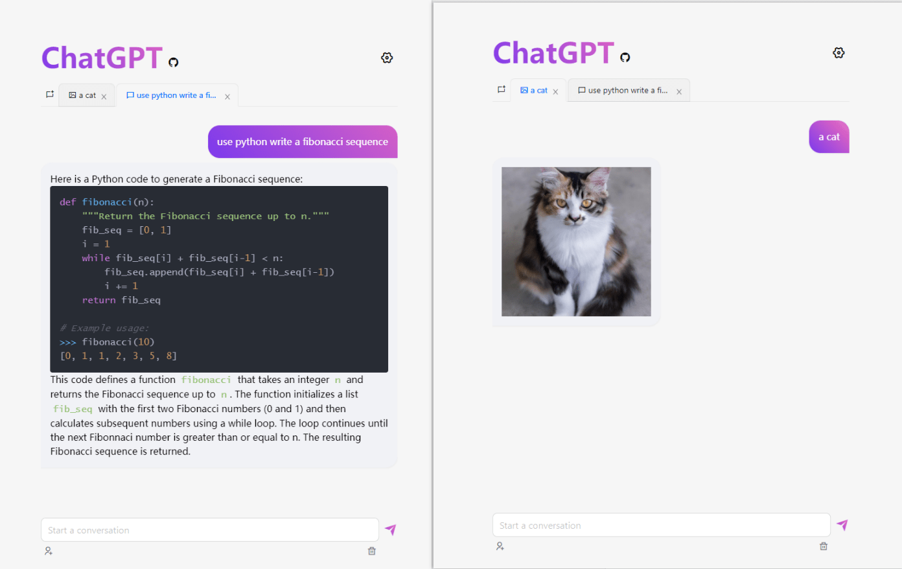

<h2 align="center">ChatGPT-Vercel</h2>

  

English | [简体中文](./README.zh-CN.md)

## Introduction
Building your own ChatGPT website by Vercel, support muti text conversations/preset prompts/images generation. Powered by OpenAI API GPT-4/3.5 and Vercel.

## Features
- [x] Text Conversation
- [x] Preset Prompts
- [x] Images Generation
- [ ] Audio

## Live Demo
- [chatgpt-vercel-sample](https://chatgpt-vercel-sample.vercel.app/)
- [chatgpt-vercel-zh-sample](https://chatgpt-vercel-zh-sample.vercel.app/)

## User Guide
You can access the online demo above or deploy it privately for experience.

- About the conversation. Click the icon at the top left to add a conversation, which has two types:
  - Text conversation:
    - By default, it is a continuous conversation, and each sending will carry the full context.
    - Supports adding preset prompts, type `/` or click the button at the bottom left to add.
    - Supports model configuration, click the settings icon at the top right to configure.
  - Image generation conversation:
    - Does not support continuous conversation, and each sending will not carry the context.
    - Directly input the image effect you want, for example: `a cat`.
    - The valid access time of the image link is `2` hours. Please save it in time if necessary.
- About the history record:
  - When `Save all conversations` is enabled in the global settings, it will be saved to local cache. By default, it will not be saved.
- About operation:
  - Press `Enter` to send, press `Shift`+`Enter` to line break
- About all settings: 
  - see [Configurations](#Configurations)

## Getting Started

### 1. Create Project
Create Vercel project from a github forked project(recommand) or the following **Deploy** button.

### 2. Set OPENAI_API_KEY
There are three ways to set your openai api key:
- Set Vercel Environment Variables **OPENAI_API_KEY**
- Rename your `.env.expample` file to `.env` and set **OPENAI_API_KEY**
- Set **OPENAI_API_KEY** within the page

## Configurations
### Deployment Configurations
All deployment configurations could be configured in the `.env` file or in **Environment Variables** of Vercel

| Configuration  | Default Value | Description                                                                          | 
| -------------- | ------------- | ------------------------------------------------------------------------------------ |
| OPENAI_API_KEY | -             | Key for API request, [how to generate](https://platform.openai.com/account/api-keys) |
| LANGUAGE       | en            | Website language, including prompts. Supported languages: **zh**/**en**              |

### Global Configurations
All global configurations will be stored locally

| Configuration             | Default Value | Description                                                                                                         |
| ------------------------- | ------------- | ------------------------------------------------------------------------------------------------------------------- |
| OpenAI Api Key            | -             | The same with the deployment configuration                                                                          |
| Model                     | gpt-3.5-turbo | Model used in api request, [supported models](https://platform.openai.com/docs/models/model-endpoint-compatibility) |
| Save all conversations    | false         | The conversation won't be lost after the page is refreshed                                                          |

## Development
Requirements:
- **NodeJS** `v16.12.0` or higher
- **pnpm** `v7` or higher

Proxy
- By default, local requests for openapi are made through a third-party proxy. If there is no need for a proxy, you can disable local proxy by setting `DISABLE_LOCAL_PROXY=true` in the `.env` file. At this point, `api.openai.com` will be directly requested.

Development:
- Run `pnpm dev`
- Expose port, for example, when using in cloud ide, run `pnpm start`

Build:
- Run `pnpm build`

## Contribution
Any contributions are highly appreciated. Here are some tips:
- To improve the translation or add a new language, modify the `lang` directory. If adding a new language, you will also need to modify `src/utils/i18n.ts`.
- To improve or add new preset prompts, modify the `prompts` directory.
- To optimize the API, modify the `src/pages/api` directory.
- To optimize page interactions, modify the `src/components` directory.
- For new feature support, please open an issue directly.

## Credits
- English prompts are modified from [awesome-chatgpt-prompts](https://github.com/f/awesome-chatgpt-prompts)
- Chinese prompts are modified from [awesome-chatgpt-prompts-zh](https://github.com/PlexPt/awesome-chatgpt-prompts-zh)

## License
Based on [MIT License](./LICENSE)
